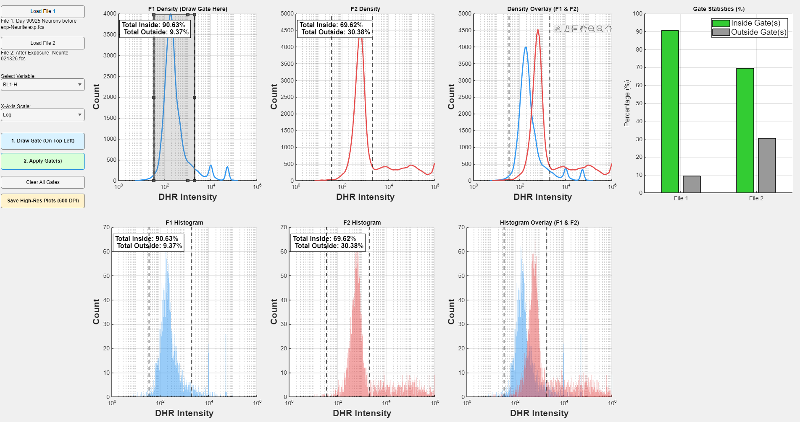

# GateMate: 1D Histogram Gating & Comparative Analysis Dashboard

**GateMate** is a unified, high-efficiency MATLAB application engineered specifically for comparative flow cytometry and fluorescence research. It empowers researchers to load two distinct FCS datasets, isolate specific parameters (e.g., DHR Intensity), apply a singular, synchronized gating strategy across both samples, and instantly generate alignment-perfect overlays and high-definition statistical bar charts.

By concentrating comparative analysis, gating, and figure generation into a single streamlined dashboard, GateMate eliminates the tedious manual alignment of figures in third-party vector software and ensures absolute mathematical consistency when comparing distinct population responses (e.g., Control vs. Exposed).

*Figure 1: The GateMate Dashboard. The left-most sample (File 1: Day 90 Neurons Before Exposure) is gated, and the exact gating boundaries are instantly synchronized to the experimental sample (File 2: After Exposure) and the overlay plots. Comparative statistics are updated and graphed in real-time.*

## 🚀 Why Use GateMate? (Value for Researchers)

* **Eliminate Manual Alignment:** Creating overlays from different FCS files with matching gating strategies in software like FlowJo, Illustrator, or PowerPoint is time-consuming and highly prone to human error. GateMate locks the X-axis (e.g., from 10^0 to 10^6) and generates immediate, perfectly aligned density and bar histogram overlays.
* **Synchronized, Unbiased Gating:** Researchers frequently need to observe how an experimental sample reacts under the *exact* same gating parameters as the control. Draw your gate(s) once on File 1, and the boundaries are instantly and mathematically projected across every view of File 2.
* **Publication-Ready Export:** Stop taking low-resolution screenshots. GateMate is designed for academia—a single click exports all 7 dashboard panels as individual, tightly cropped, 600 DPI publication-quality figures. Plot titles are automatically hidden during export for a clean, professional aesthetic ready for manuscript submission.

## ✨ Key Features

* **Dual FCS Handling:** Seamless, side-by-side comparative analysis between two loaded datasets.
* **7-Panel Integrated View:**
  * **Top Row:** F1 Density, F2 Density, Density Overlay (F1 vs F2), and Grouped Statistics Bar Chart.
  * **Bottom Row:** F1 Standard Bar Histogram, F2 Standard Bar Histogram, Transparent Histogram Overlay.
* **Advanced Synergized Gating:** Draw multiple rectangular gates to capture distinct subpopulations. The application calculates the union of these gates and applies the boundaries across all 7 plots simultaneously.
* **Real-Time Statistical Readouts:** Inside/Outside gate percentages are calculated automatically, displayed within standardized text boxes on the primary plots, and visualized in the grouped bar chart.
* **Standardized Axis:** The X-axis defaults to `DHR Intensity` with bold labels to keep the focus on targeted assays (easily customizable in the code for other markers).

## 🛠️ Prerequisites

To run this application, you need:
* **MATLAB** (App Designer components are used, which are included in standard modern MATLAB installations).
* **Statistics and Machine Learning Toolbox** (required for `ksdensity` estimations on the smooth curve plots).
* **fca_readfcs.m**: A free, standard MATLAB File Exchange script required to read FCS 3.0 files. This script must be placed in your active MATLAB path.

## 🏃 Getting Started & Workflow

1. **Launch:** Open MATLAB and run `HistogramComparisonApp.m` (or your saved script name).
2. **Load Data:** Use the controls in the left panel to load **File 1** (e.g., Control/Before) and **File 2** (e.g., Experimental/After).
3. **Select Parameter:** Choose your variable from the dropdown (e.g., `BL1-H`) and select your scale (`Log` or `Linear`).
4. **Draw Gate:** Click **"1. Draw Gate (On Top Left)"**. A rectangular ROI will appear on the F1 Density plot. Resize and position it over your target population. (You can draw additional gates if needed).
5. **Apply Gate:** Click **"2. Apply Gate(s)"**. The dashed boundaries, percentage text boxes, and statistical bar charts will instantly populate across the entire dashboard.
6. **Export:** Click **"Save High-Res Plots (600 DPI)"**. Choose your save destination and base filename. The app will cleanly generate 7 individual, high-resolution `.png`, `.pdf`, or `.eps` files.

## 🎨 Customization (Tuning)

GateMate is built to be easily modifiable. At the very top of the MATLAB script, a dedicated `%% Global Visual Settings` section allows you to quickly adjust the aesthetics without digging through complex plotting code:

* **Colors:** Change `color1` and `color2` using standard strings (e.g., `'blue'`, `'red'`, `'green'`) or RGB arrays.
* **Histograms:** Adjust `numBins` for resolution, and `histFaceAlpha` for overlay transparency.
* **Labels & Fonts:** Universally adjust `xAxisLabelText` (e.g., change from 'DHR Intensity' to your specific wavelength/marker), along with standard font sizes for titles, ticks, and text boxes.
